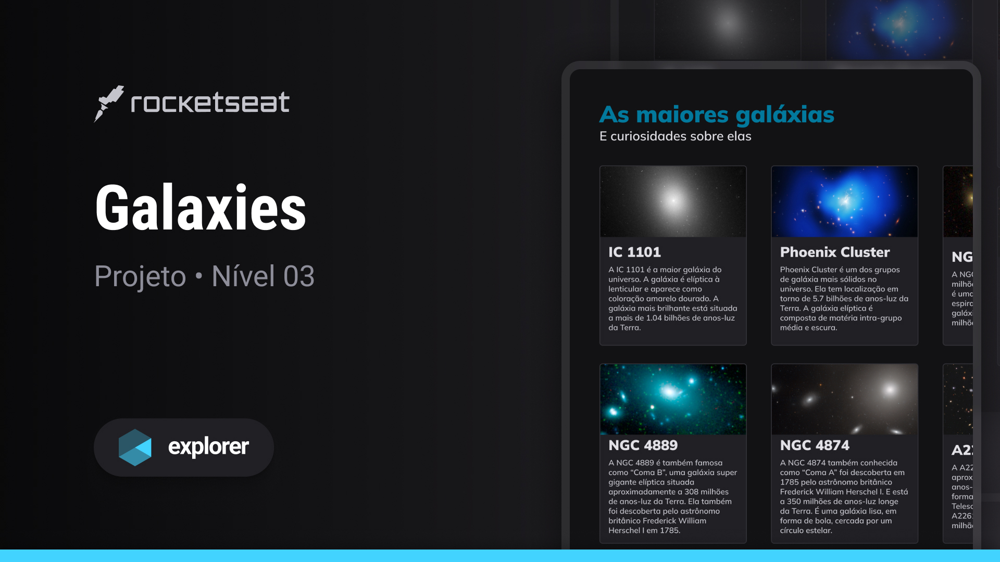

<h1 align="center"> Explorando Galáxias </h1>

  Projeto simples desenvolvido para estudar HTML, CSS e Grid, com foco em compartilhar informações fascinantes sobre galáxias.

  <a href="#-tecnologias">Tecnologias</a>&nbsp;&nbsp;&nbsp;|&nbsp;&nbsp;&nbsp;
  <a href="#-projeto">Projeto</a>&nbsp;&nbsp;&nbsp;|&nbsp;&nbsp;&nbsp;
  <a href="#memo-licença">Licença</a> 

  

 

  

## 🚀 Tecnologias

Esse projeto foi desenvolvido com as seguintes tecnologias:

- HTML
- CSS
- Grid CSS

## 💻 Projeto

O projeto consiste em compartilhar informações interessantes sobre galáxias, oferecendo uma experiência simples e educativa, utilizando também as funcionalidades do Grid CSS.

- [Acesse o Projeto online](https://guedescss.github.io/galaxies-stage03/)

Feito by GuedesCSS :wave:
